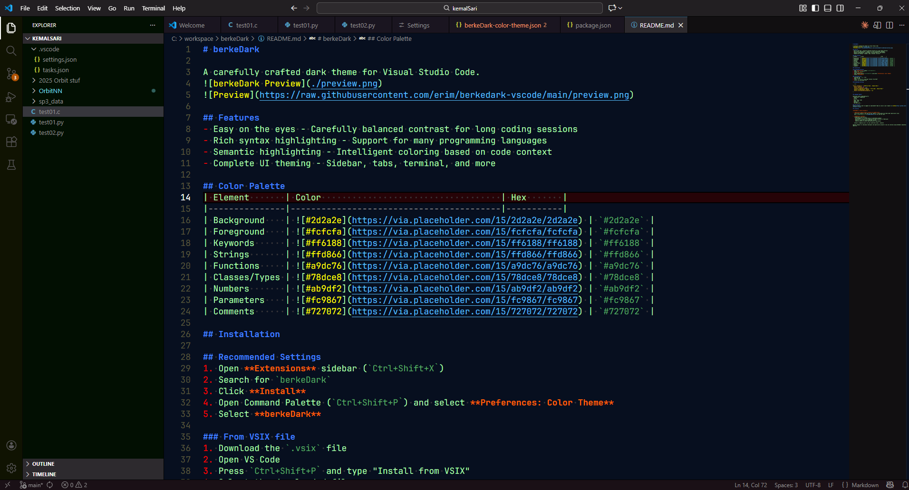
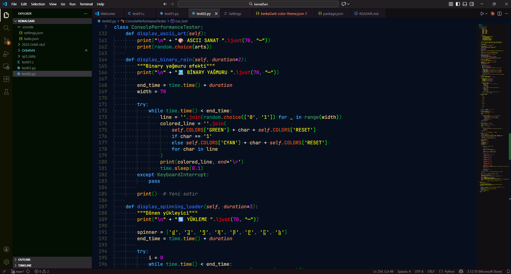
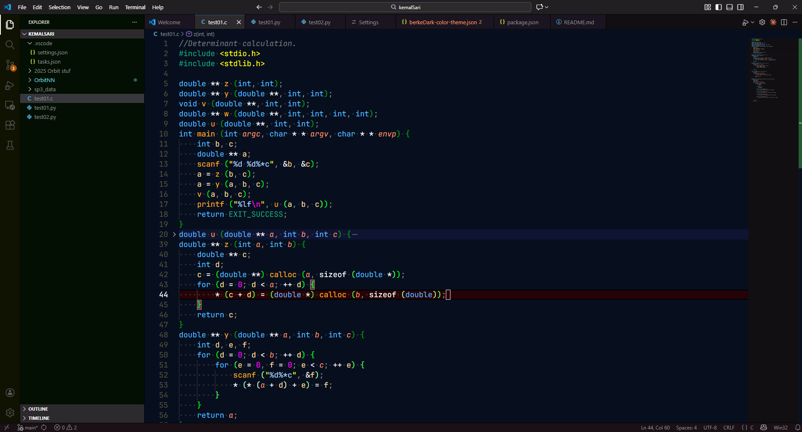

# berkeDark

A carefully crafted dark theme for Visual Studio Code.





## Features
- Easy on the eyes - Carefully balanced contrast for long coding sessions
- Rich syntax highlighting - Support for many programming languages
- Semantic highlighting - Intelligent coloring based on code context
- Complete UI theming - Sidebar, tabs, terminal, and more

## Color Palette
| Element       | Color                                   | Hex       |
|---------------|-----------------------------------------|-----------|
| Background    |  | `#2d2a2e` |
| Foreground    |  | `#fcfcfa` |
| Keywords      |  | `#ff6188` |
| Strings       |  | `#ffd866` |
| Functions     |  | `#a9dc76` |
| Classes/Types |  | `#78dce8` |
| Numbers       |  | `#ab9df2` |
| Parameters    |  | `#fc9867` |
| Comments      |  | `#727072` |

## Installation

## Recommended Settings
1. Open **Extensions** sidebar (`Ctrl+Shift+X`)
2. Search for `berkeDark`
3. Click **Install**
4. Open Command Palette (`Ctrl+Shift+P`) and select **Preferences: Color Theme**
5. Select **berkeDark**

### From VSIX file
1. Download the `.vsix` file
2. Open VS Code
3. Press `Ctrl+Shift+P` and type "Install from VSIX"
4. Select the downloaded file

## Recommended Settings

```json
{
"editor.fontFamily": "'JetBrains Mono', 'Ubuntu Mono'",
  "editor.fontSize": 14,
  "editor.fontLigatures": true,
  "terminal.integrated.fontFamily": "'Fira Code', 'Ubuntu Mono'"
  "editor.cursorBlinking": "blink",
  "editor.cursorSmoothCaretAnimation": "on"
}
```

## Language Support

Optimized syntax highlighting for:
- JavaScript / TypeScript
- Python
- C / C++
- HTML / CSS / SCSS
- JSON / YAML
- Markdown
- And many more...

## Contributing
Found an issue or want to suggest an improvement? Open an issue or pull request on [GitHub](https://github.com/BerkeGulmen/berkedark-vscode).

## Licensing

**berkeDark is dual-licensed:**

1. **GNU Affero General Public License v3.0 (AGPL-3.0)**  
   → Use this license if you want to use, modify, or distribute the theme under open-source rules.  
   See [`LICENSE-AGPLv3.txt`](LICENSE-AGPLv3.txt) for the full text.

2. **Commercial License**  
   → Required if you wish to:
   - Use berkeDark in a closed-source or proprietary product
   - Distribute it as part of a commercial VS Code extension or theme pack
   - Remove or hide the license/copyright notices
   - Avoid the AGPL-3.0 source code disclosure requirements  

   Contact: berkeleykhan outlook

Nothing changes for individual developers and open-source projects — you can continue using berkeDark completely free under AGPL-3.0.